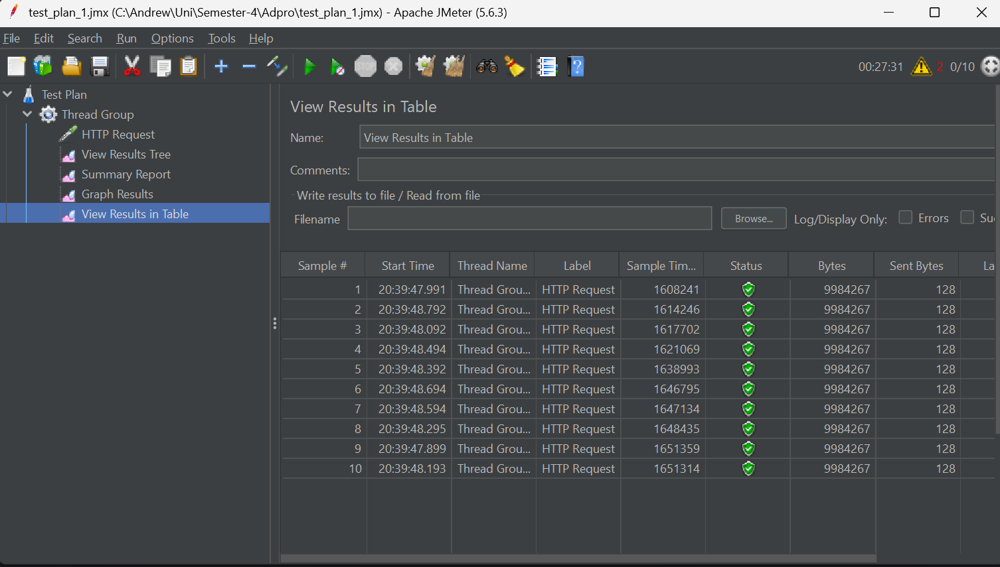
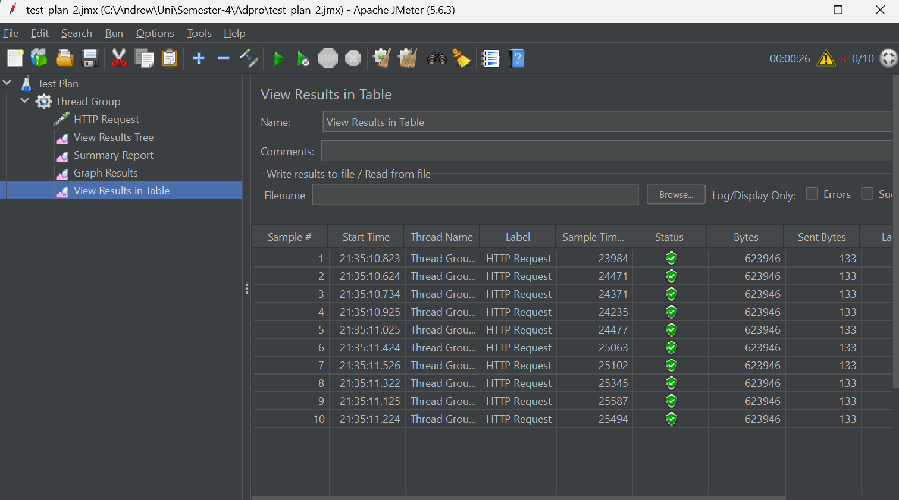
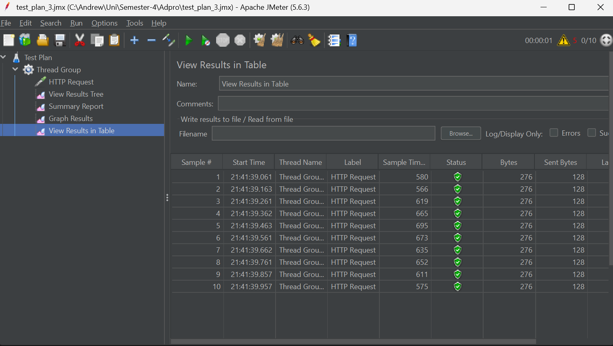
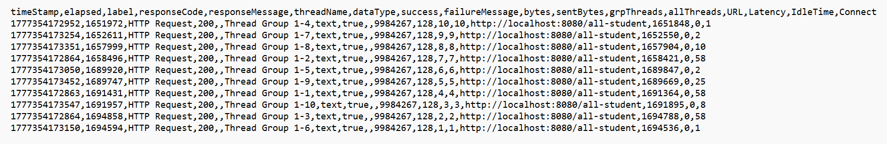
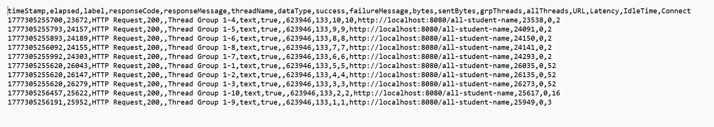
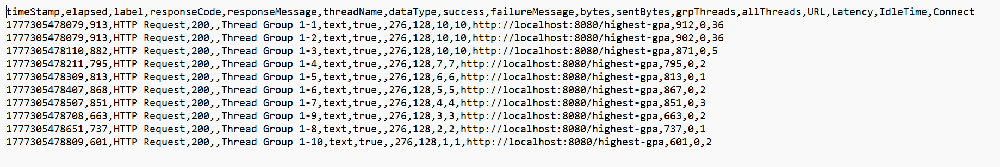

# Module-7-Profiling
adpro stuff

## GUI and CLI log screenshots
### GUI /all-student

### GUI /all-student-name

### GUI /highest-gpa

### CLI /all-student log

### CLI /all-student-name log

### CLI /highest-gpa log

## Reflection
> 1. While performing tests with jmeter, things like latency and throughput while with
>> the Intellij profiler, you can see the total time, cpu time for each function call
> 2. it helps identify which parts need optimization. for example, in the joinStudentNames function
>> the number was highest on the loop, indicating that something in the loop needed optimization
> 3. I do think that the Intellij profiler is useful, as i mentioned in the previous question, it
>> helped me figure out which parts needed optimization
> 4. The largest challenge, i think, is time. when there is a lot of data, trying to test it takes half
>> an hour for me, and i think it takes up so much time, to the point i feel a bit averse to doing it
> 5. I can see which functions need optimization. and even which parts of the function take the most time.
> 6. First look at the time in jmeter, because that should be closer to the actual thing, then for seeing
>> which parts need optimization, look at the profiler to identify them
> 7. See jmeter for time, and profiler for optimization. Strategies implemented can be like using
>> String builder instead of +=, optimizing query calls, and others. Ensuring the correct result can
>> be done with some unit testing
